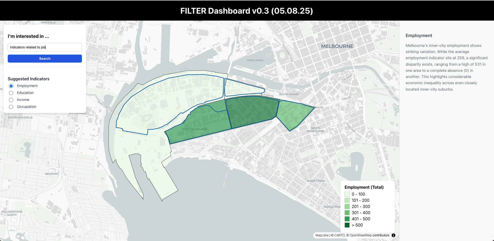

# How to run maplibre react.js

<em> Before following the below steps, make sure the maplibre react is running successfully on your machine, further instructions on how to install react and its dependencies (e.g., maplibre-gl), follow https://docs.maptiler.com/react/maplibre-gl-js/how-to-use-maplibre-gl-js/</em>

- cd to the directory (/Map Demonstrator) 
- On the first run, it may be necessary to install dependencies using `yarn install`
- Run  `yarn react-scripts start` (This will lunch a localhost on one port)

### Components
- All scripts are located in `src/components` folder which includes map js and css files.

### Data folder
- the folder `public/data` includes all .Geojson files for the webmap dashboard.

