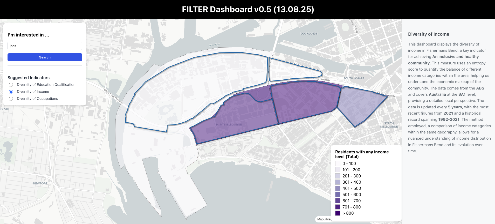

# How to run maplibre react.js

### Run backend for indicator selection

The backend which is a RAG-based system for selecting the most relevant indicators for user input query, needs to be first loaded successfully as follows:
- cd to `src/components` 
- run `python app_server.py` : this will run the the app_server.py as backend in the allocated port (e.g, http://127.0.0.1:5000)

* If it is sucessfull, you will see Backend ready check box.

### If the port is in use dow the following:
- `lsof -i :YOUR_PORT_NUMBER`
- `kill -9 PID`

### Launch the webapp as frontend

<em> Before following the below steps, make sure the maplibre react is running successfully on your machine, further instructions on how to install react and its dependencies (e.g., maplibre-gl), follow https://docs.maptiler.com/react/maplibre-gl-js/how-to-use-maplibre-gl-js/</em>

- cd to the directory (/Map Demonstrator) 
- On the first run, it may be necessary to install dependencies using `yarn install`
- Run  `yarn react-scripts start` (This will lunch a localhost on one port)

### Components
- All scripts are located in `src/components` folder which includes map js and css files.

### Data folder
- the folder `public/data` includes all .Geojson files for the webmap dashboard.

### API Keys for LLM and MapTiler 
- Provide your Gemini API key and MapTiler API key in the `.env.local` file. 

### Contributors
- Mohammad Kazemi Beydokhti
- Matt Duckham
