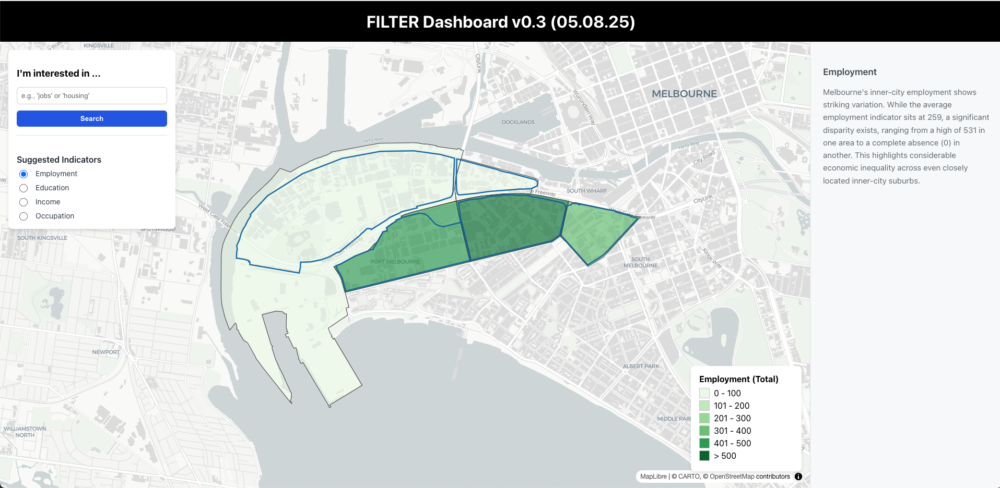

# How to run maplibre react.js

### Run backend for indicator selection

The backend which is a RAG-based system for selecting the most relevant indicators for user input query, needs to be first loaded successfully as follows:
- cd to `src/components` 
- run `python app_server.py` : this will run the the app_server.py as backend in the allocated port (e.g, http://127.0.0.1:5000)

* If it is sucessfull, you will see Backend ready check box.

### If the port is in use do the following:
- `lsof -i :YOUR_PORT_NUMBER`
- `kill -9 PID`

### Launch the webapp as frontend

<em> Before following the below steps, make sure the maplibre react is running successfully on your machine, further instructions on how to install react and its dependencies (e.g., maplibre-gl), follow https://docs.maptiler.com/react/maplibre-gl-js/how-to-use-maplibre-gl-js/</em>

- cd to the directory (/Map Demonstrator) 
- On the first run, it may be necessary to install dependencies using `yarn install`
- Run  `yarn start` (This will launch a localhost on one port)

### Components
- All scripts are located in `src/components` folder which includes map js and css files.

### Data folder
- the folder `public/data` includes all .Geojson files for the webmap dashboard.

### API Keys for LLM and MapTiler 
- Provide your Gemini API key and MapTiler API key in the `.env.local` file. 

<!--  -->

## Cloud Deployment (AWS)

This project is deployed using a split-stack architecture on AWS to handle the separate React frontend and Python backend.

### Architecture
* **Frontend:** Deployed on **AWS Amplify** (Static hosting & CD).
* **Backend:** Deployed on **AWS App Runner** (Containerized web service).

### 1. Backend Hosting (AWS App Runner)
The Python Flask backend (`app_server.py`) is hosted as a scalable service.
* **Source:** Connected directly to the GitHub repository.
* **Configuration:**
    * **Runtime:** Python 3
    * **Source Directory:** `Map_Dashboard/Map_Demonstrator`
    * **Build Command:** `pip install -r src/components/requirements.txt`
    * **Start Command:** `gunicorn -b 0.0.0.0:5000 --chdir src/components app_server:app`
* **Port:** `5000`

### 2. Frontend Hosting (AWS Amplify)
The React/MapLibre application is built and hosted via Amplify.
* **Monorepo Setup:** Configured to point to the project root: `Map_Dashboard/Map_Demonstrator`.
* **Environment Integration:**
    To allow the frontend to communicate with the backend, the App Runner service URL is set as an environment variable in the Amplify console:
    * `REACT_APP_API_URL`: `https://[your-app-runner-url].awsapprunner.com`

### 3. Deployment Notes
* **Folder Structure:** Ensure folder names do not contain spaces (e.g., use `Map_Dashboard` instead of `Map Dashboard`) to prevent build script failures in the Linux environment.
* **Production Server:** The backend uses `gunicorn` for production stability, replacing the standard Flask development server used locally.

### Contributors
- Mohammad Kazemi Beydokhti
- Matt Duckham

